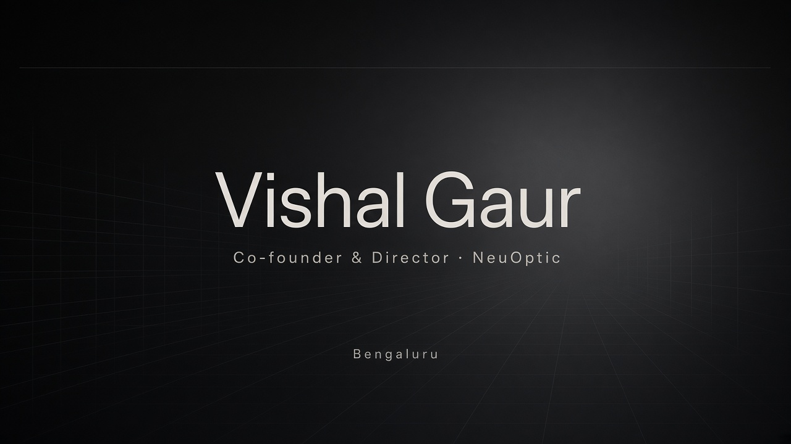

 

**Co-founder & Director @ [NeuOptic Private Limited](https://neuoptic.in) · Full-stack / AI engineer**

Bengaluru · Building products at the intersection of interfaces, operations, and intelligent systems

[neuoptic.in](https://neuoptic.in) · [NeoEngine](https://engine.neolab.in) · [LinkedIn](https://www.linkedin.com/in/vishalgaur1) · [Email](mailto:vishalgaur2002@gmail.com)

---

### About

I design and ship product interfaces end-to-end — from the first screen to the systems underneath.  
At **NeuOptic Private Limited**, I lead product and frontend work across AR commerce experiences and workforce software, with full-stack ownership on NeoEngine.

---

### NeuOptic Private Limited

Practical tools for real businesses — web AR catalogues and staff operations software.

| Product | What it is |
|:--------|:-----------|
| **[Arvi](https://neuoptic.in)** | AR product experiences for restaurants, furniture, artifacts, textiles, and industrial catalogues — powered by our in-house render engine so many 3D models stay smooth in-browser, including on phones |
| **[NeoEngine](https://engine.neolab.in)** | Staff ops & SOP platform — reminders, workflows, attendance, payroll, and HR tooling so teams run themselves |

---

### Featured

**[VOXORYL](https://github.com/vishalgaur1/VOXORYL)** — Local-first voice desktop companion with on-device reasoning, private memory, and optional computer control.  
[Site](https://vishalgaur1.github.io/VOXORYL/) · *vox-OR-ill* · short name **Voxy**

---

### Focus

`React` · `TypeScript` · `UI/UX` · `Full-stack` · `AR / 3D on the web` · `Product engineering`

---

<!-- ─── FOOTER ─── -->

 

 

<strong><a href="https://github.com/vishalgaur1/VOXORYL">VOXORYL</a></strong>
· voice that stays on your machine
· <a href="https://vishalgaur1.github.io/VOXORYL/">site</a>

  

<code>Python</code>&nbsp;·&nbsp;<code>Local AI</code>&nbsp;·&nbsp;<code>Voice</code>

  

<a href="mailto:vishalgaur2002@gmail.com">vishalgaur2002@gmail.com</a>

